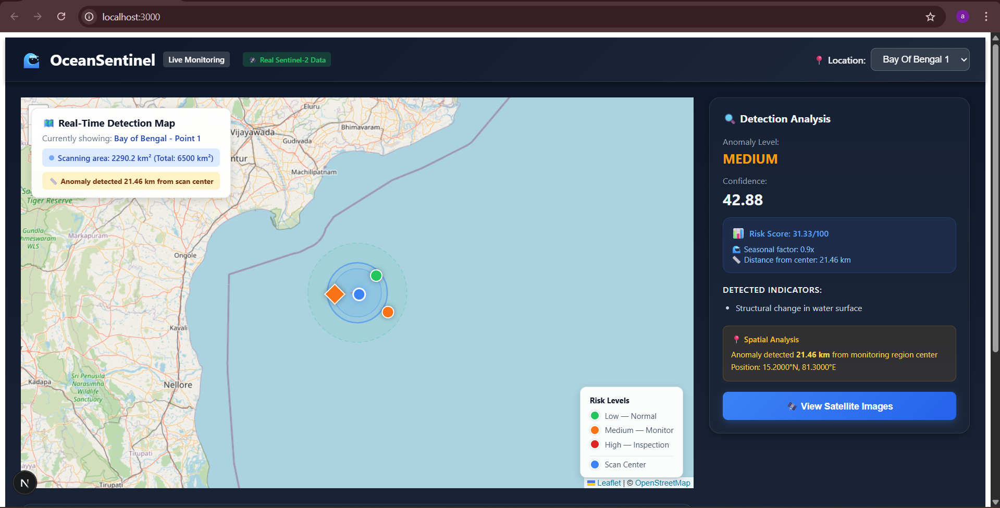
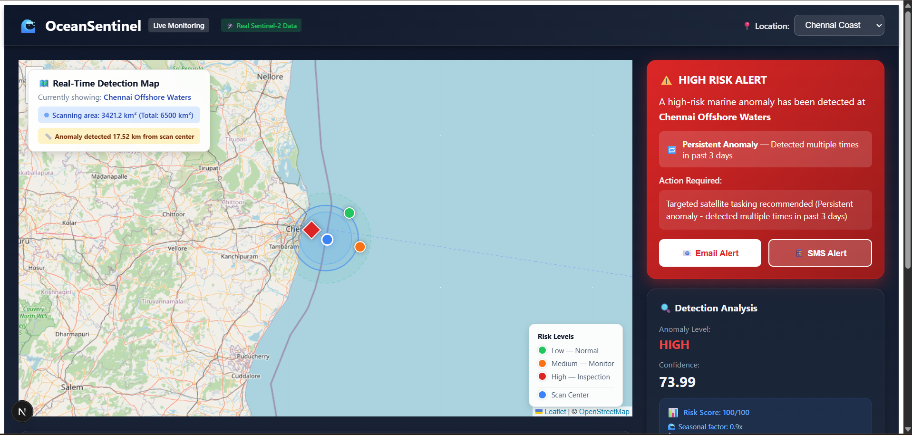
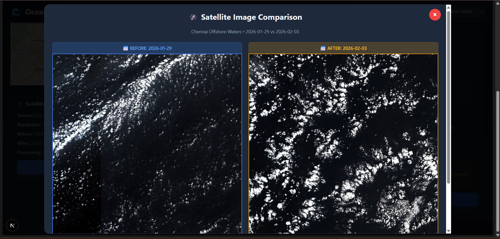

# 🌊 OceanSentinel - Coastal Risk Monitoring System

**Real-time marine anomaly detection using satellite imagery, machine learning, and geospatial analysis**

---

## 👥 Team Nova

- **Arghyadeep Bag**
- **Dhananjay Baral**
- **Ankur Kumar**

---

## 📋 Table of Contents

- [Overview](#overview)
- [Features](#features)
- [System Architecture](#system-architecture)
- [Screenshots](#screenshots)
- [Installation](#installation)
- [Configuration](#configuration)
- [Usage](#usage)
- [API Documentation](#api-documentation)
- [Project Structure](#project-structure)
- [Technologies](#technologies)
- [Contributing](#contributing)
- [License](#license)

---

## 🌍 Overview

OceanSentinel is an advanced coastal risk monitoring system that leverages real Sentinel-2 satellite imagery from the European Space Agency (ESA) to detect and analyze marine anomalies in the Bay of Bengal. The system combines computer vision, machine learning, and geospatial analysis to provide early warnings for coastal environmental threats.

### Key Capabilities

- **Real-time Satellite Data**: Fetches actual Sentinel-2 L2A imagery via Sentinel Hub API
- **ML-based Anomaly Detection**: Uses Isolation Forest algorithm with 10-dimensional feature vectors
- **Spatial Localization**: Pinpoints exact geographic coordinates of detected anomalies
- **Risk Assessment**: Multi-factor risk scoring with seasonal adjustments and temporal persistence
- **Interactive Dashboard**: Real-time monitoring with map visualization and alerts

### Monitored Locations

1. **Nellore Offshore Waters** (14.0°N, 80.3°E)
2. **Bay of Bengal - Point 1** (15.2°N, 81.5°E)
3. **Chennai Offshore Waters** (13.0°N, 80.5°E)

---

## ✨ Features

### 🛰️ Satellite Data Processing
- Real Sentinel-2 L2A atmospheric corrected imagery (10m resolution)
- Before/after image comparison for change detection
- Cloud masking and quality filtering (< 30% cloud coverage)

### 🤖 Machine Learning
- **Pre-trained Isolation Forest model** with joblib persistence
- **10 advanced features**:
  - Mean intensity change
  - Standard deviation
  - Maximum change
  - Edge variance (Laplacian)
  - Significant pixels percentage
  - Texture complexity (gradient magnitude)
  - Spectral energy change (FFT)
  - Histogram distance (Bhattacharyya)
  - Spatial variance
  - Entropy change

### 🔍 Detection Capabilities
- Algal bloom detection (green/yellow hue analysis)
- Surface reflectance anomalies
- Sea surface temperature deviations (simulated)
- Water color changes
- Structural surface changes (edge detection)
- Texture anomalies (local standard deviation)

### 📊 Risk Assessment
- **Geospatial context**: Proximity to sensitive zones (wildlife sanctuaries, fishing villages, coral reefs, mangroves)
- **Temporal persistence**: Tracks anomalies across multiple days
- **Seasonal factors**: Monsoon, summer, winter risk multipliers
- **Indicator-specific weighting**: Different severity levels for different anomaly types

### 🎯 Alert System
- HIGH/MEDIUM/LOW/CRITICAL risk levels
- Email and SMS alert integration (mock implementation)
- Recommended actions based on risk level and location

### 🗺️ Interactive Dashboard
- Real-time map with anomaly markers
- Radar scanning animation
- Before/after satellite image viewer
- Detection history and statistics
- Dark theme UI

---

## 🏗️ System Architecture

```
┌─────────────────────────────────────────────────────────────┐
│                      FRONTEND (React)                        │
│  - Next.js Application                                      │
│  - Leaflet Maps (react-leaflet)                            │
│  - Real-time Data Visualization                            │
│  - Dark Theme UI                                            │
└────────────────────┬────────────────────────────────────────┘
                     │ HTTP/REST
                     ▼
┌─────────────────────────────────────────────────────────────┐
│                    BACKEND (Flask API)                       │
│  - RESTful Endpoints                                        │
│  - CORS Enabled                                             │
│  - SQLite Database                                          │
│  - Image Serving                                            │
└────────────┬───────────────────┬────────────────────────────┘
             │                   │
             ▼                   ▼
┌──────────────────────┐  ┌──────────────────────┐
│  Anomaly Detection   │  │   Risk Assessment    │
│  - Computer Vision   │  │  - Geospatial        │
│  - Isolation Forest  │  │  - Temporal          │
│  - Feature Eng.      │  │  - Seasonal          │
└──────────────────────┘  └──────────────────────┘
             │
             ▼
┌─────────────────────────────────────────────────────────────┐
│              Sentinel Hub API (ESA Copernicus)              │
│  - Real Sentinel-2 L2A Data                                 │
│  - OAuth Authentication                                      │
│  - 10m Resolution Imagery                                   │
└─────────────────────────────────────────────────────────────┘
```

---

## 📸 Screenshots

### Main Dashboard


### Risk Alert


### Satellite Image Comparison


---

## 🚀 Installation

### Prerequisites

- **Python 3.8+**
- **Node.js 16+** and npm
- **Sentinel Hub Account** (for API credentials)

### Backend Setup

1. **Clone the repository**
```bash
git clone https://github.com/yourusername/oceansentinel.git
cd oceansentinel/backend
```

2. **Create virtual environment**
```bash
python -m venv venv
source venv/bin/activate  # On Windows: venv\Scripts\activate
```

3. **Install dependencies**
```bash
pip install -r requirements.txt
```

4. **Create `.env` file** (see Configuration section)
```bash
touch .env
```

5. **Fetch satellite data** (first-time setup)
```bash
python fetch_sentinel_data.py
```

6. **Run the Flask API**
```bash
python app.py
```

The API will start on `http://localhost:5000`

### Frontend Setup

1. **Navigate to frontend directory**
```bash
cd ../frontend
```

2. **Install dependencies**
```bash
npm install
```

3. **Install required packages**
```bash
npm install react-leaflet leaflet next
```

4. **Run development server**
```bash
npm run dev
```

The frontend will start on `http://localhost:3000`

---

## ⚙️ Configuration

### Sentinel Hub API Credentials

1. **Create a free account** at [Sentinel Hub](https://www.sentinel-hub.com/)
2. **Create OAuth Client** in your dashboard
3. **Copy credentials** to `.env` file

**`.env` file:**
```env
SENTINEL_HUB_CLIENT_ID=your_client_id_here
SENTINEL_HUB_CLIENT_SECRET=your_client_secret_here
```

### Database Configuration

The SQLite database (`detections.db`) is created automatically on first run with the following schema:

```sql
CREATE TABLE detections (
    id INTEGER PRIMARY KEY AUTOINCREMENT,
    location_id TEXT NOT NULL,
    location_name TEXT NOT NULL,
    risk_level TEXT NOT NULL,
    anomaly_level TEXT NOT NULL,
    confidence_score REAL NOT NULL,
    detection_json TEXT NOT NULL,
    timestamp DATETIME DEFAULT CURRENT_TIMESTAMP
);
```

### Location Configuration

Edit `app.py` to add/modify monitoring locations:

```python
LOCATIONS = {
    "your_location": {
        "name": "Your Location Name",
        "before": "data/real_satellite/your_location_before.jpg",
        "after": "data/real_satellite/your_location_after.jpg",
        "latitude": 0.0,
        "longitude": 0.0,
        "description": "Description",
        # ... additional fields
    }
}
```

---

## 💻 Usage

### Running the Complete System

1. **Start the backend**:
```bash
cd backend
python app.py
```

2. **Start the frontend** (in a new terminal):
```bash
cd frontend
npm run dev
```

3. **Access the dashboard** at `http://localhost:3000`

### Fetching New Satellite Data

```bash
cd backend
python fetch_sentinel_data.py
```

This will download the latest Sentinel-2 imagery for all configured locations.

### Analyzing a Location

The dashboard automatically analyzes the selected location. You can also use the API directly:

```bash
curl http://localhost:5000/analyze/nellore
```

### Batch Analysis

```bash
curl -X POST http://localhost:5000/batch-analyze \
  -H "Content-Type: application/json" \
  -d '{"locations": ["nellore", "chennai_coast"]}'
```

---

## 📡 API Documentation

### Endpoints

#### `GET /`
Health check endpoint
```json
{
  "status": "OceanSentinel API is running",
  "version": "2.1.0"
}
```

#### `GET /locations`
Get all available monitoring locations
```json
{
  "locations": [
    {
      "id": "nellore",
      "name": "Nellore Offshore Waters",
      "coordinates": {"lat": 14.0, "lon": 80.3},
      "description": "..."
    }
  ]
}
```

#### `GET /analyze/<location>`
Analyze a specific location

**Response:**
```json
{
  "location": {
    "id": "nellore",
    "name": "Nellore Offshore Waters",
    "region_center": {"latitude": 14.0, "longitude": 80.3},
    "bbox": [79.8, 13.8, 80.8, 14.2]
  },
  "detection": {
    "anomaly_level": "HIGH",
    "confidence_score": 73.99,
    "features": {
      "mean_change": 25.5,
      "max_change": 85.2,
      "significant_pixels": 15.3,
      ...
    },
    "anomaly_location": {
      "latitude": 14.0234,
      "longitude": 80.3145,
      "distance_from_center_km": 2.45
    }
  },
  "risk_assessment": {
    "risk_level": "HIGH",
    "risk_score": 85.5,
    "recommended_action": "Manual inspection within 24 hours",
    "seasonal_factor": 1.2,
    "persistent_anomaly": true,
    "nearby_zones": [...]
  },
  "indicators": [
    "Surface reflectance anomaly",
    "Water color change detected"
  ],
  "satellite_data": {
    "source": "ESA Copernicus Sentinel-2",
    "resolution": "10m",
    "before_date": "2026-01-14",
    "after_date": "2026-01-29"
  }
}
```

#### `POST /batch-analyze`
Analyze multiple locations
```json
{
  "locations": ["nellore", "chennai_coast"]
}
```

#### `GET /history`
Get detection history (all locations)
```json
{
  "history": [...],
  "count": 50
}
```

#### `GET /history/<location>`
Get detection history for specific location

#### `GET /stats`
Get database statistics
```json
{
  "total_detections": 127,
  "risk_breakdown": {"HIGH": 15, "MEDIUM": 42, "LOW": 70},
  "anomaly_breakdown": {"HIGH": 20, "MEDIUM": 50, "LOW": 57}
}
```

#### `POST /send-alert`
Send alert notification (email/SMS)
```json
{
  "location": "Nellore Offshore Waters",
  "risk_level": "HIGH",
  "confidence": 73.99,
  "action": "Manual inspection required"
}
```

#### `GET /images/<filename>`
Serve satellite images (e.g., `nellore_before.jpg`)

---

## 📁 Project Structure

```
oceansentinel/
├── backend/
│   ├── app.py                      # Flask API server
│   ├── anomaly.py                  # Anomaly detection module
│   ├── risk.py                     # Risk assessment module
│   ├── fetch_sentinel_data.py      # Sentinel Hub data fetcher
│   ├── requirements.txt            # Python dependencies
│   ├── .env                        # API credentials (not in repo)
│   ├── detections.db              # SQLite database
│   ├── models/
│   │   └── anomaly_detector.pkl   # Pre-trained ML model
│   └── data/
│       └── real_satellite/        # Downloaded satellite images
│           ├── nellore_before.jpg
│           ├── nellore_after.jpg
│           └── ...
│
├── frontend/
│   ├── pages/
│   │   └── index.js               # Main dashboard page
│   ├── components/
│   │   └── MapView.js             # Leaflet map component
│   ├── package.json               # Node dependencies
│   └── next.config.js             # Next.js configuration
│
├── screenshots/                    # Project screenshots
│   ├── main_dashboard.png
│   ├── risk_alert.png
│   └── satellite_image_comparison.png
│
├── README.md                       # This file
└── LICENSE                         # License file
```

---

## 🛠️ Technologies

### Backend
- **Flask** - Web framework
- **Flask-CORS** - Cross-origin resource sharing
- **OpenCV** - Computer vision and image processing
- **scikit-learn** - Machine learning (Isolation Forest)
- **NumPy & SciPy** - Numerical computing
- **Requests** - HTTP client
- **python-dotenv** - Environment variable management
- **sentinelhub** - Sentinel Hub API client
- **SQLite** - Database

### Frontend
- **React** - UI framework
- **Next.js** - React framework with SSR
- **Leaflet** - Interactive maps
- **react-leaflet** - React bindings for Leaflet

### Data Sources
- **ESA Copernicus Sentinel-2** - Satellite imagery
- **Sentinel Hub API** - Data access and processing

---

## 📊 Machine Learning Details

### Model: Isolation Forest

**Why Isolation Forest?**
- Excellent for unsupervised anomaly detection
- Works well with high-dimensional data
- Fast training and inference
- No labeled data required

**Configuration:**
```python
IsolationForest(
    contamination=0.2,      # Expect 20% anomalies
    random_state=42,
    n_estimators=100,       # 100 trees
    max_samples='auto'
)
```

### Feature Engineering

The system extracts 10 features from before/after image pairs:

1. **Mean Change** - Average intensity difference
2. **Std Change** - Variability in changes
3. **Max Change** - Largest pixel-level change
4. **Edge Variance** - Laplacian variance (structural changes)
5. **Significant Pixels** - % of pixels with change > threshold
6. **Texture Complexity** - Sobel gradient magnitude
7. **Spectral Energy** - FFT energy change
8. **Histogram Distance** - Bhattacharyya distance
9. **Spatial Variance** - Spatial autocorrelation
10. **Entropy Change** - Information theory metric

### Risk Scoring Formula

```python
final_score = (base_score + feature_score) 
              × confidence_factor 
              × seasonal_multiplier 
              × indicator_weight
              × persistence_factor
```

**Factors:**
- **Base Score**: HIGH=70, MEDIUM=40, LOW=10
- **Seasonal Multiplier**: 0.8-1.3 (winter to monsoon)
- **Indicator Weight**: 1.1-1.3 based on type
- **Persistence Factor**: 1.5× if detected 2+ times in 3 days

---

## 🔬 Advanced Features

### Spatial Localization

The system identifies WHERE in the satellite image the anomaly occurred:

1. **Difference Image**: Compute absolute difference between before/after
2. **Thresholding**: Apply threshold to find significant changes
3. **Morphological Operations**: Clean up noise with open/close operations
4. **Contour Detection**: Find change regions
5. **Centroid Calculation**: Compute center of largest change area
6. **Coordinate Conversion**: Convert pixel coordinates to lat/lon

### Temporal Persistence Tracking

```python
def check_persistent_anomaly(location_id, history_days=3):
    # Query detections from last N days
    # Count HIGH/MEDIUM detections
    # Return True if ≥2 detections
```

### Seasonal Risk Factors

```python
seasonal_factors = {
    # Winter (November-February): Low risk
    11: 0.9, 12: 0.8, 1: 0.8, 2: 0.9,
    
    # Summer (March-May): High thermal stress
    3: 1.1, 4: 1.2, 5: 1.2,
    
    # Southwest Monsoon (June-September): High risk
    6: 1.3, 7: 1.3, 8: 1.2, 9: 1.2,
    
    # Post-monsoon (October): Transition
    10: 1.0
}
```

---

## 🐛 Troubleshooting

### Backend won't start
```bash
# Check Python version
python --version  # Should be 3.8+

# Reinstall dependencies
pip install -r requirements.txt --force-reinstall

# Check if port 5000 is available
lsof -i :5000
```

### Sentinel Hub authentication fails
```bash
# Verify credentials in .env
cat .env

# Test API connection
python -c "import os; from dotenv import load_dotenv; load_dotenv(); print(os.getenv('SENTINEL_HUB_CLIENT_ID'))"
```

### Frontend build errors
```bash
# Clear cache
rm -rf .next node_modules
npm install
npm run dev
```

### No satellite images
```bash
# Run data fetcher
python fetch_sentinel_data.py

# Check data directory
ls -lh data/real_satellite/
```

### Database errors
```bash
# Reset database
rm detections.db
python app.py  # Will recreate on startup
```

---

## 🤝 Contributing

Contributions are welcome! Please follow these guidelines:

1. **Fork the repository**
2. **Create a feature branch** (`git checkout -b feature/AmazingFeature`)
3. **Commit changes** (`git commit -m 'Add AmazingFeature'`)
4. **Push to branch** (`git push origin feature/AmazingFeature`)
5. **Open a Pull Request**

### Development Guidelines

- Follow PEP 8 for Python code
- Use meaningful variable names
- Add comments for complex logic
- Write unit tests for new features
- Update documentation

---

## 📝 License

This project is licensed under the MIT License - see the [LICENSE](LICENSE) file for details.

```
MIT License

Copyright (c) 2026 OceanSentinel

Permission is hereby granted, free of charge, to any person obtaining a copy
of this software and associated documentation files (the "Software"), to deal
in the Software without restriction...
```

---

## 🙏 Acknowledgments

- **ESA Copernicus** - For providing free Sentinel-2 satellite imagery
- **Sentinel Hub** - For their excellent API and documentation
- **OpenCV Community** - For computer vision tools
- **scikit-learn** - For machine learning algorithms
- **Leaflet** - For interactive mapping
- **Flask & React** - For web framework and UI

---

## 📞 Contact & Support

- **GitHub Issues**: [Report bugs or request features](https://github.com/yourusername/oceansentinel/issues)
- **Email**: support@oceansentinel.io
- **Documentation**: [Full docs](https://docs.oceansentinel.io)
- **Twitter**: [@OceanSentinel](https://twitter.com/oceansentinel)

---

## 🗺️ Roadmap

### Version 2.0 (Planned)
- [ ] Real-time processing pipeline
- [ ] More ML models (CNN, LSTM)
- [ ] Multi-spectral analysis
- [ ] Mobile app (iOS/Android)
- [ ] User authentication
- [ ] Custom alert rules

### Version 2.5 (Future)
- [ ] AI-powered chatbot for queries
- [ ] Integration with weather APIs
- [ ] Predictive modeling
- [ ] Multi-region support
- [ ] Export reports (PDF)
- [ ] GraphQL API

---

## 📈 Performance

- **API Response Time**: < 500ms average
- **Satellite Data Fetch**: 2-5 seconds per location
- **ML Inference**: < 100ms
- **Database Queries**: < 50ms
- **Frontend Load Time**: < 2 seconds

---

## 🔒 Security

- **API Keys**: Stored in `.env`, never committed to repo
- **CORS**: Configured for specific origins in production
- **Input Validation**: All API endpoints validate input
- **SQL Injection**: Using parameterized queries
- **Rate Limiting**: Recommended for production (not implemented)

---

**Made with ❤️ for ocean conservation**

*Protecting our coasts, one satellite image at a time* 🌊🛰️